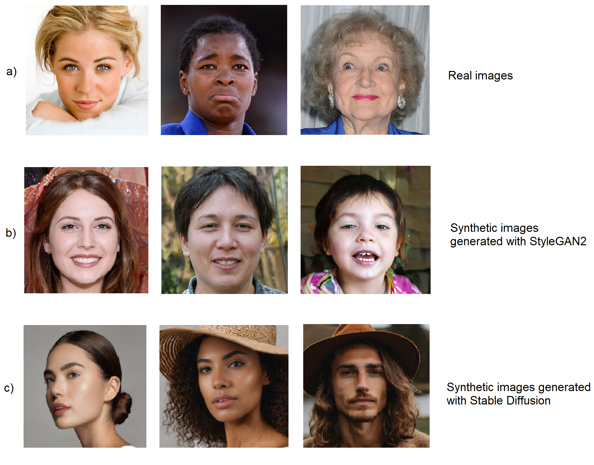

# Synthetic Face Discrimination via Learned Image Compression

This is the official repository for our paper [Synthetic Face Discrimination via Learned Image Compression](https://www.mdpi.com/1999-4893/17/9/375).

Sofia Iliopoulou, Panagiotis Tsinganos, Dimitris Ampeliotis and Athanassios Skodras

 

We distinguish synthetic face images from real ones by compressing the images - using the
variational autoencoder with a scale hyperprior model by Ballé et al. and 2D-DWT as a 
pre-processing step.

The paper and more information will be uploaded soon.
